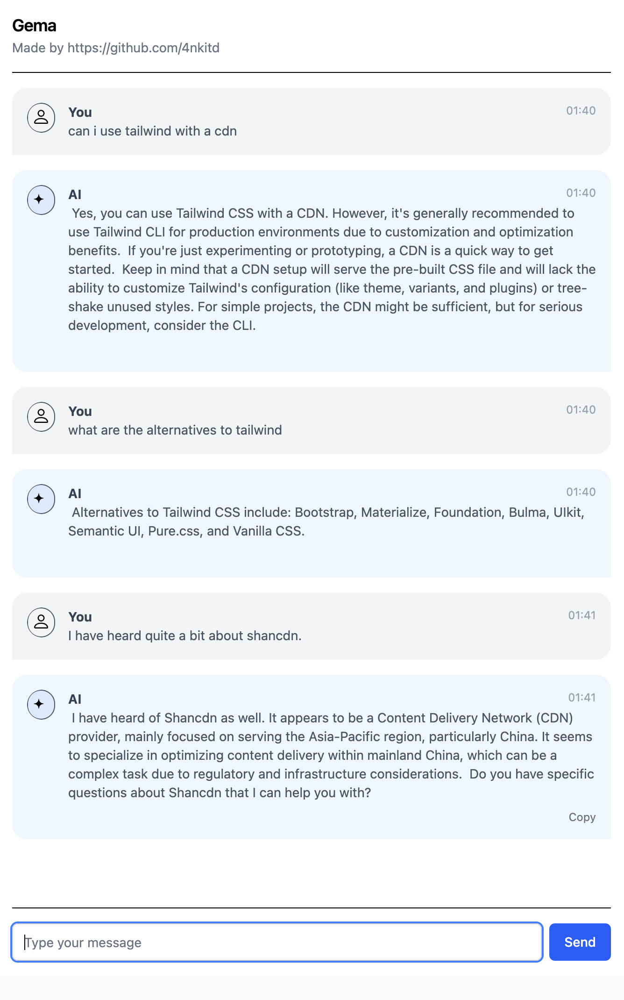

# Gema CLI

Gema CLI is an AI assistant for your terminal that leverages Gemini AI to help with text refinement, command suggestions, and Git commit messages. It's designed to make your terminal experience more productive through AI-powered assistance.

## DEMO

[](https://www.youtube.com/watch?v=yklcZ4dNYWg)

# Web UI


 WebCmd represents the web command which starts a web server for AI interactions.
 It provides both a web UI and a REST API endpoint for asking questions to the AI.

 The server automatically attempts to open the web interface in the default browser.
 
### Usage:
   gema-cli web

### Environment Variables:
   GENAI_PORT - Custom port to run the server on (defaults to 8080)

### Web Interface:
   http://localhost:8080/

### API Endpoint:
   POST http://localhost:8080/answer
   Request Body: {"message": "your question", "history": {"previous question": "previous answer", ...}}
   Response: {"message": "AI response"}

> The web interface provides a user-friendly chat experience, while the API allows for
 programmatic interaction with the AI assistant.

## Installation

```bash
git clone https://github.com/4nkitd/gema-cli.git
cd gema-cli
go build -o gema
```

For easier access, move the binary to your PATH:

```bash
mv gema /usr/local/bin/
```

## Setup

Before using Gema CLI, set your Gemini API key and default model as environment variables:

```bash
export GENAI_API_KEY=your_api_key
export GENAI_DEFAULT_MODEL="gemini-2.0-flash-exp"
```

You can obtain your API key from [Google AI Studio](https://aistudio.google.com/).

Add these to your `.bashrc`, `.zshrc`, or equivalent for persistence.

## Commands

### Text Refinement

Revise text to make it more professional:

```bash
gema writer "Hey, can we meet to discuss the project?"
gema revise "Hey, can we meet to discuss the project?" # alias
```

Special formatting options:
- Use `[length=X]` to specify approximate word count
- Use `[type=email]` to format as a professional email

Example:
```bash
gema writer "Need to reschedule our meeting tomorrow. Sorry for late notice." [type=email]
```

### AI Assistant

Ask questions and get command suggestions:

```bash
gema cli "how do I find large files in this directory?"
gema ask "how do I find large files in this directory?" # alias
```

The command will:
1. Process your query
2. Show a response
3. Suggest a terminal command
4. Ask if you want to run the command

### Git Commit Helper

Generate AI-powered commit messages:

```bash
gema commit
gema c # alias
```

You can also specify a repository path:
```bash
gema commit /path/to/repo
```

Or customize the prompt:
```bash
gema commit --prompt "Write a detailed commit message explaining the following changes:"
```

### Co Pilot

Get assistance with anything on your screen:

```bash
gema assist "explain this error message"
gema a "explain this error message" # alias
gema copilot "suggest improvements for this code" # alias
gema assistant "what does this output mean?" # alias
```

The Co Pilot feature analyzes text from your terminal and provides helpful explanations, suggestions, or guidance based on the content.

Example:
```bash
gema assist "What's wrong with this command: grep -l 'function' | xargs sed 's/old/new/g'"
```

## Contributing

Contributions are welcome! Please feel free to submit a Pull Request.
